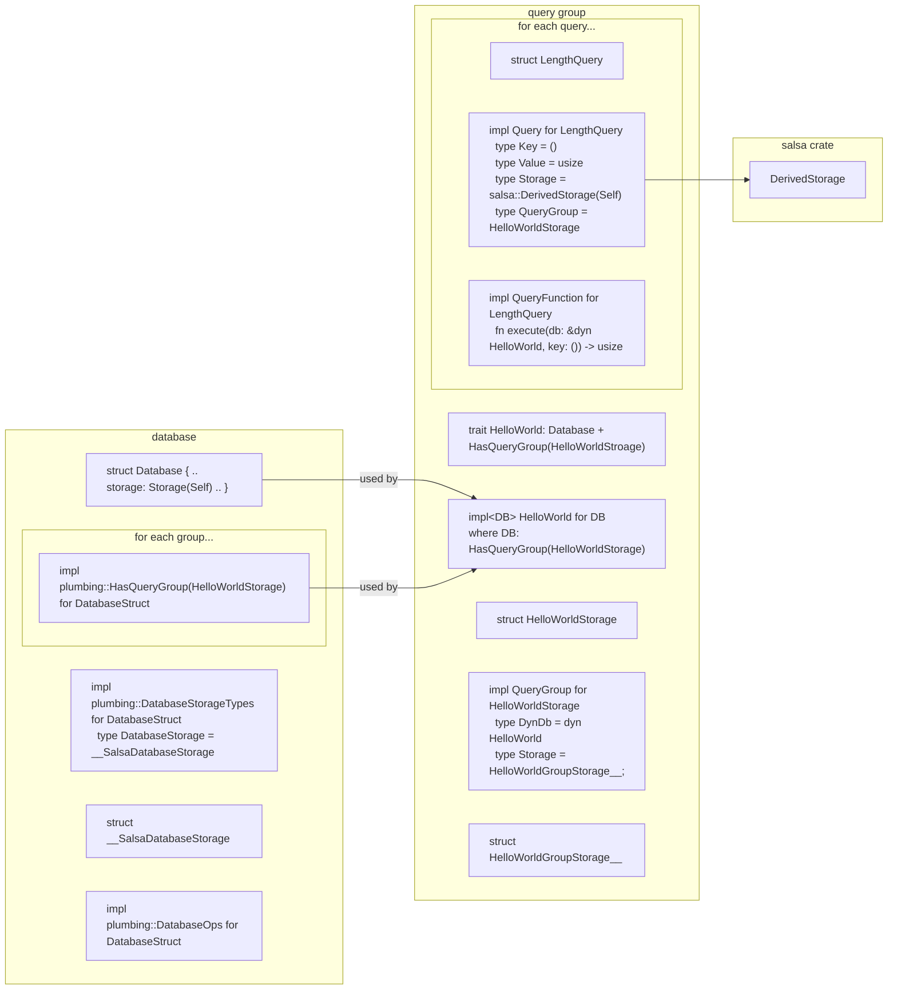

# Diagram

This diagram shows the items that get generated from the Hello World query group and database struct. You can click on each item to be taken to the explanation of its purpose. The diagram is wide so be sure to scroll over!

