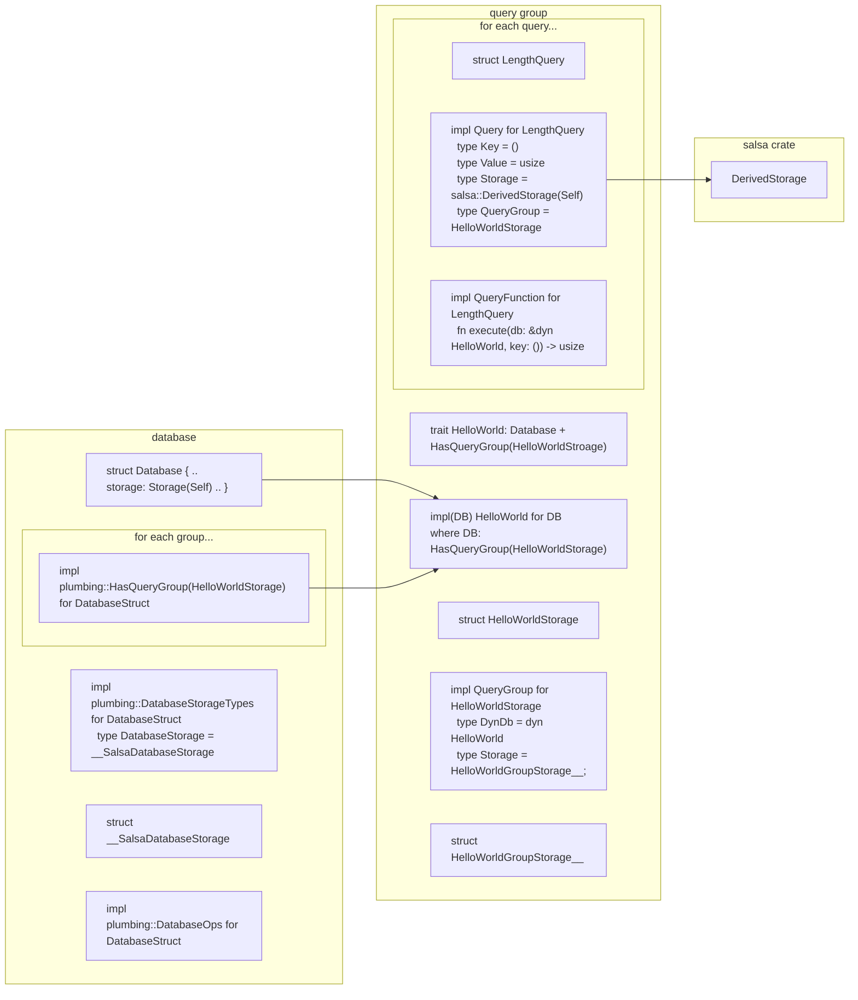

# Diagram

Based on the hello world example:

```rust,ignore
{{#include ../../../examples/hello_world/main.rs:trait}}
```

```rust,ignore
{{#include ../../../examples/hello_world/main.rs:database}}
```

