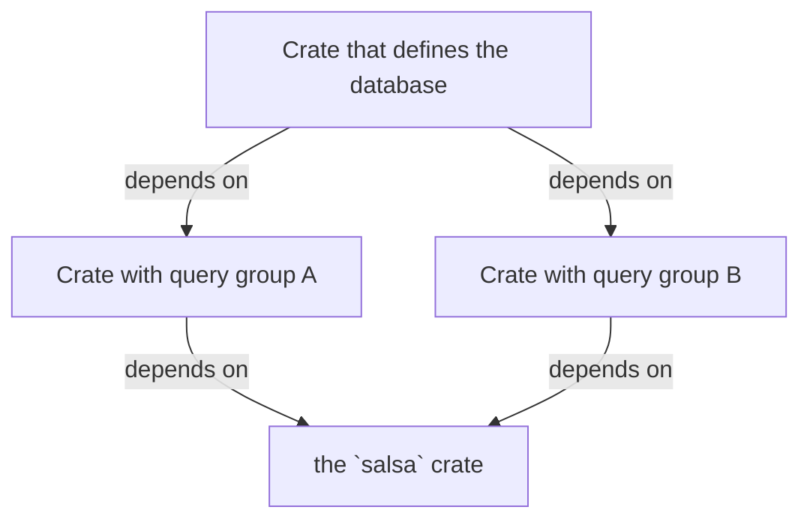
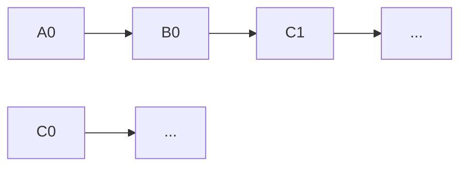

# Dynamic databases

## Metadata

* Author: nikomatsakis
* Date: 2020-06-29
* Introduced in: [salsa-rs/salsa#1](https://github.com/salsa-rs/salsa/pull/1) (please update once you open your PR)

## Summary

* Retool Salsa's setup so that the generated code for a query group is not
  dependent on the final database type, and interacts with the database only
  through `dyn` trait values.
* This imposes a certain amount of indirecton but has the benefit that when a
  query group definition changes, less code must be recompiled as a result.
* Key changes include:
  * Database keys are "interned" in the database to produce a
    `DatabaseKeyIndex`.
  * The values for cached query are stored directly in the hashtable instead of
    in an `Arc`. There is still an Arc per cached query, but it stores the
    dependency information.
  * The various traits are changed to make `salsa::Database` dyn-safe. Invoking
    methods on the runtime must now go through a `salsa::Runtime` trait.
  * The `salsa::requires` functionality is removed.
* Upsides of the proposal:
  * Potentially improved recompilation time. Minimal code is regenerated.
  * Removing the `DatabaseData` unsafe code hack that was required by slots.
* Downsides of the proposal:
  * The effect on runtime performance must be measured.
  * `DatabaseKeyIndex` values will leak, as we propose no means to reclaim them.
    However, the same is true of `Slot` values today.
  * Storing values for the tables directly in the hashtable makes it less
    obvious how we would return references to them in a safe fashion (before, I
    had planned to have a separate module that held onto the Arc for the slot,
    so we were sure the value would not be deallocated; one can still imagine
    supporting this feature, but it would require some fancier unsafe code
    reasoning, although it would be more efficient.)
  * The `salsa::requires` functionality is removed.

## Motivation

Under the current salsa setup, all of the "glue code" that manages cache
invalidation and other logic is ultimately parameterized by a type `DB` that
refers to the full database. The problem is that, if you consider a typical
salsa crate graph, the actual value for that type is not available until the
final database crate is compiled:



The result is that we do not actually compile a good part of the code from
`QueryGroupA` or `QueryGroupB` until we build the final database crate.

### What you can do today: dyn traits

What you can do today is to use define a "dyn-compatible" query group
trait and then write your derived functions using a `dyn` type as the
argument:

```rust,ignore
#[salsa::query_group(QueryGroupAStorage)]
trait QueryGroupA {
    fn derived(&self, key: usize) -> usize;
}

fn derived(db: &dyn QueryGroupA, key: usize) -> usize {
    key * 2
}
```

This has the benefit that the `derived` function is not generic. However, it's
still true that the glue code salsa makes will be generic over a `DB` type --
this includes the impl of `QueryGroupA` but also the `Slot` and other machinery.
This means that even if the only change is to query group B, in a different
crate, the glue code for query group A ultimately has to be recompiled whenever
the `Database` crate is rebuilt (though incremental compilation may help here).
Moreover, as reported in [salsa-rs/salsa#220], measurements of rust-analyzer
suggest that this code may be duplicated and accounting for more of the binary
than we would expect.

FIXME: I'd like to have better measurements on the above!

[salsa-rs/salsa#220]: https://github.com/salsa-rs/salsa/issues/220

### Our goal

The primary goal of this RFC is to make it so that the glue code we generate for
query groups is not dependent on the database type, thus enabling better
incremental rebuilds.

## User's guide

Most of the changes in this RFC are "under the hood". But there are various user
visibile changes proposed here.

### All query groups must be dyn safe

The largest one is that **all Salsa query groups must now be dyn-safe**. The
existing salsa query methods are all dyn-safe, so what this really implies is
that one cannot have super-traits that use generic methods or other things that
are not dyn safe. For example, this query group would be illegal:

```rust,ignore
#[salsa::query_group(QueryGroupAStorage)]
trait QueryGroupA: Foo {
}

trait Foo {
    fn method<T>(t: T) { }
}
```

We could support query groups that are not dyn safe, but it would require us to
have two "similar but different" ways of generating plumbing, and I'm not
convinced that it's worth it. Moreover, it would require some form of opt-in so
that would be a measure of user complexity as well.

### All query functions must take a dyn database

You used to be able to implement queries by using `impl MyDatabase`, like so:

```rust,ignore
fn my_query(db: &impl MyDatabase, ...) { .. }
```

but you must now use `dyn MyDatabase`:

```rust,ignore
fn my_query(db: &dyn MyDatabase, ...) { .. }
```

### Databases embed a `Storage<DB>` with a fixed field name

The "Hello World" database becomes the following:

```rust,ignore
#[salsa::database(QueryGroup1, ..., QueryGroupN)]
struct MyDatabase {
    storage: salsa::Storage<Self>
}

impl salsa::Database for MyDatabase {}
```

In particular:

* You now embed a `salsa::Storage<Self>` instead of a `salsa::Runtime<Self>`
* The field **must** be named `storage` by default; we can include a `#[salsa::storge_field(xxx)]` annotation to change that default if desired.
  * Or we could scrape the struct declaration and infer it, I suppose.
* You no longer have to define the `salsa_runtime` and `salsa_runtime_mut` methods, they move to the `DatabaseOps` trait and are manually implemented by doing `self.storage.runtime()` and so forth.

Why these changes, and what is this `Storage` struct? This is because the actual
storage for queries is moving outside of the runtime. The Storage struct just
combines the `Runtime` (whose type no longer references `DB` directly) with an
`Arc<DB::Storage>`. The full type of `Storage`, since it includes the database
type, cannot appear in any public interface, it is just used by the various
implementations that are created by `salsa::database`.

### Instead of `db.query(Q)`, you write `Q.in_db(&db)`

As a consequence of the previous point, the existing `query` and `query_mut`
methods on the `salsa::Database` trait are changed to methods on the query types
themselves. So instead of `db.query(SomeQuery)`, one would write
`SomeQuery.in_db(&db)` (or `in_db_mut`). This both helps by making the
`salsa::Database` trait dyn-safe and also works better with the new use of `dyn`
types, since it permits a coercion from `&db` to the appropriate `dyn` database
type at the point of call.

### The salsa-event mechanism will move to dynamic dispatch

A further consequence is that the existing `salsa_event` method will be
simplified and made suitable for dynamic dispatch. It used to take a closure
that would produce the event if necessary; it now simply takes the event itself.
This is partly because events themselves no longer contain complex information:
they used to have database-keys, which could require expensive cloning, but they
now have simple indices.

```rust
fn salsa_event(&self, event: Event) {
    #![allow(unused_variables)]
}
```

This may imply some runtime cost, since various parts of the machinery invoke
`salsa_event`, and those calls will now be virtual calls. They would previously
have been static calls that would likely have been optimized away entirely.

It is however possible that ThinLTO or other such optimization could remove
those calls, this has not been tested, and in any case the runtime effects are
not expected to be high, since all the calls will always go to the same
function.

### The `salsa::requires` function is removed

We currently offer a feature for "private" dependencies between query groups
called `#[salsa::requires(ExtraDatabase)]`. This then requires query
functions to be written like:

```rust,ignore
fn query_fn(db: &impl Database + ExtraDatabase, ...) { }
```

This format is not compatible with `dyn`, so this feature is removed.

## Reference guide

### Example

To explain the proposal, we'll use the Hello World example, lightly adapted:

```rust
#[salsa::query_group(HelloWorldStorage)]
trait HelloWorld: salsa::Database {
    #[salsa::input]
    fn input_string(&self, key: ()) -> Arc<String>;

    fn length(&self, key: ()) -> usize;
}

fn length(db: &dyn HelloWorld, (): ()) -> usize {
    // Read the input string:
    let input_string = db.input_string(());

    // Return its length:
    input_string.len()
}

#[salsa::database(HelloWorldStorage)]
struct DatabaseStruct {
    runtime: salsa::Runtime<DatabaseStruct>,
}

impl salsa::Database for DatabaseStruct {
    fn salsa_runtime(&self) -> &salsa::Runtime<Self> {
        &self.runtime
    }

    fn salsa_runtime_mut(&mut self) -> &mut salsa::Runtime<Self> {
        &mut self.runtime
    }
}
```

### Identifying queries using the `DatabaseKeyIndex`

We introduce the following struct that represents a database key using a series
of indices:

```rust,ignore
struct DatabaseKeyIndex {
    /// Identifies the query group.
    group_index: u16,

    /// Identifies the query within the group.
    query_index: u16,

    /// Identifies the key within the query.
    key_index: u32,
}
```

This struct allows the various query group structs to refer to database keys
without having to use a type like `DB::DatabaseKey` that is dependent on the
`DB`.

The group/query indices will be assigned by the `salsa::database` and
`salsa::query_group` macros respectively. When query group storage is created,
it will be passed in its group index by the database. Each query will be able to
access its query-index through the `Query` trait, as they are statically known
at the time that the query is compiled (the group index, in contrast, depends on
the full set of groups for the database).

The key index can be assigned by the query as it executes without any central
coordination. Each query will use a [`IndexMap`] mapping `Q::Key -> QueryState`.
Inserting new keys into this map also creates new indices, and it is possible to
index into the map in O(1) time later to obtain the state (or key) from a given
query. This map replaces the existing `Q::Key -> Arc<Slot<..>>` map that is used
today.

[`IndexMap`]: https://crates.io/crates/indexmap

One notable implication: we cannot remove entries from the query index map
(e.g., for GC) because that would invalidate the existing indices. We can
however replace the query-state with a "not computed" value. This is not new:
slots already take this approach today. In principle, we could extend the
tracing GC to permit compressing and perhaps even rewriting indices, but it's
not clear that this is a problem in practice.

The `DatabaseKeyIndex` also supports a `debug` method that returns a value with
a human readable `debug!` output, so that you can do `debug!("{:?}",
index.debug(db))`. This works by generating a `fmt_debug` method that is
supported by the various query groups.

### The various query traits are not generic over a database

Today, the `Query`, `QueryFunction`, and `QueryGroup` traits are generic over
the database `DB`, which allows them to name the final database type and
associated types derived from it. In the new scheme, we never want to do that,
and so instead they will now have an associated type, `DynDb`, that maps to the
`dyn` version of the query group trait that the query is associated with.

Therefore `QueryFunction` for example can become:

```rust
pub trait QueryFunction: Query {
    fn execute(db: &Self::DynDb, key: Self::Key) -> Self::Value;
    fn recover(db: &Self::DynDb, cycle: &[DB::DatabaseKey], key: &Self::Key) -> Option<Self::Value> {
        let _ = (db, cycle, key);
        None
    }
}
```

### Storing query results and tracking dependencies

In today's setup, we have all the data for a particular query stoerd in a
`Slot<Q, DB, MP>`, and these slots hold references to one another to track
dependencies. Because the type of each slot is specific to the particular query
`Q`, the references between slots are done using a `Arc<dyn DatabaseSlot<DB>>`
handle. This requires some unsafe hacks, including the `DatabaseData` associated
type.

This RFC proposes to alter this setup, moving to a different approach. The
queries store the overall query state and its cached value (if any) inline in the hashmap, similar to what we did before adopting slots. However, the dependency information for each query remains in an `Arc<DependencySlot>`.

This new type `DependencySlot` only stores the dependency information for each
query `Q`, such as:

* the revision where `Q` last changed
* the revision where `Q` was last verified
* links to the `Arc<DependencySlot>` for the dependent queries that `Q` invoked

Unlike the old `Slot<DB, Q, MP>` type, the `DependencySlot` type is not
dependent on the query `Q`. This removes the need for `DatabaseData` while
retaining a lot of the benefits of slots: we can revalidate without needing to
access the master hashtable.

This proposal is also anticipating an eventual design that I would like to move
towards, in which the query state is a simple cache that stores the result of a
query once it is fully computed, and the handling of "in progress" queries is
separated and only used for those queries that require 'at most once per
revision' execution semantics (either because they are expensive or for other
reasons).

### A closer look at `DependencySlot` and revalidation

In the current slot-based design, the slot for a given query key is allocated
once and always remains up-to-date, even when the query is re-executed (because
its inputs have changed). Thus all of the slot's data is effectively under a
lock.

This RFC proposes to create a fresh `Arc<DependencySlot>` each time the query is
re-executed. This makes *almost all* the fields in the `DependencySlot`
immutable, including the list of dependencies. This in turn means that those
fields can be traversed during revalidation without acquiring any read-locks.

There is one complication, though. It sometimes happens that we a query Q has a
dirty input, and hence is re-executed, but we find that its output has not
changed. In this case, we will have allocated a fresh `DependencySlot`, which
may have distinct inputs and other information. We want to replace the old
dependency slot with this new one. For this reason, we store references to
dependency slots using an `ArcSwap`, which allows us to store a replacement,
though it does imply that while traversing dependencies we will have to do
atomic loads.

The exact structure proposed is as follows:

```rust
struct DependencySlot {
    /// What query key does this dependency represent?
    key_index: DatabaseKeyIndex,

    /// When was this dependency last verified?
    verified_at: AtomicCell<Revision>,

    /// Initially stores `None`. If the value for this key
    /// has been recomputed, this field
    /// will be updated to point to the replacement.
    replacement: ArcSwapOption<DependencySlot>,

    /// Revision when the value for this key last changed.
    changed_at: Revision,

    /// Minimum durability of any input.
    durability: Durability,

    /// Set of inputs (if known).
    inputs: Inputs,
}

enum Inputs {
    /// We know the full set of inputs (possibly empty).
    FullyKnown { Vec<ArcSwap<DependencySlot>> },

    ///
    Untracked,
}
```

#### Implementing maybe-changed-since

The `DependencySlot` type offers a `maybe_changed_since` operation with the following signature. Note the new return type:

```rust,ignore
impl DependencySlot {
    /// Checks if the computation represented by this dependency slot
    /// may be out of date as of `revision`. Returns:
    ///
    /// * `Ok(true)`, if the value may have changed
    /// * `Ok(false)`, if the value cannot have changed
    /// * `Err(slot)`, if the value had to be re-executed and
    ///   hence a new slot was created. In that case, this slot
    ///   is out of date and should be replaced with the new one,
    ///   and the method should be invoked again, but on the new slot.
    fn maybe_changed_since(
        &self,
        db: &dyn salsa::Database,
        revision: Revision,
    ) -> Result<bool, Arc<DependencySlot>> {
        ...
    }
}
```

The method is implemented as follows:

* If `self.replacement` is `Some(slot)`, return `Err(slot)`.
* If `self.verified_at` is the current revision, return `Ok(self.changed_at > revision)`.
* Determine if any input may have changed (see below). If not, update `self.verified_at` to the current revision and return `Ok(false)`.
* Re-execute by invoking `db.revalidate(self.key_index)`, which returns a `DependencySlot` that we will call `r`. We discuss the `revalidate` method below.
* Set `self.replacement` to `Some(r)`. Note that there is a potential race here. But if `self.replacement` has changed from `None`, it can only have been changed to `Some(r)` by some other thread.
* Return `Err(r)`.

#### Determining if inputs have changed

To determine if inputs have changed:

* If there are any untracked inputs, return true.
* Iterate over the `Vec<ArcSwap<DependencySlot>>` inputs.
* For each input `s: &ArcSwap<DepencySlot>`:
  * Load its current value `s0` and invoke `s0.maybe_changed_since(..)`:
  * If `Ok(true)` is returned, return true.
  * If `Ok(false)` is returned, continue iteration.
  * If `Err(s1)` is returned, then `s.store(s1)` and process the current input slot again.

#### The revalidate method

"Revalidation" means to re-execute a query method whose direct inputs may have
changed and then check if the new result is the same as the old one. If it is,
then then the `changed_at` revision is not altered.

Previously we held a direct reference to the `Arc<Slot<..>>` for a query, and
hence revalidation could be performed by invoking a method on it. But in the new
system when we find that a query is dirty, we have only a `DatabaseKeyIndex`.

Therefore, we extend the `salsa::plumbing::DatabaseOps` trait, the `QueryGroup`
trait, and the `Query` trait with a `revalidate` method, as shown below:

```rust,ignore
trait DatabaseOps {
    /// New method:
    fn revalidate(&self, index: DatabaseKeyIndex) -> Arc<DependencySlot>;

    /// Existing method (signature slightly tweaked):
    fn for_each_query(&self, op: &mut dyn FnMut(&dyn QueryStorageMassOps<Self>));
}

trait QueryGroup {
    ...

    fn revalidate(
        &self,
        db: &Self::DynDb,
        key: &Self::GroupKey,
        index: DatabaseKeyIndex,
    ) -> Arc<DependencySlot>;
}

trait Query {
    ...

    fn revalidate(
        &self,
        db: &Self::DynDb,
        key: &Self::Key,
        index: DatabaseKeyIndex,
    ) -> Arc<DependencySlot>;
}
```

The `DatabaseOps::revalidate` method implementation is auto-generated by the
`salsa::database` procedural macro. It works by loading the `DatabaseKey`
corresponding to `index` and matching to determine the query group the index
belongs to and extract the appropriate group key. It then invokes the
`QueryGroup::revalidate` method.

The `QueryGroup::revalidate` method is generated as part of the
`salsa::query_group` macro. It will match against the `key` to determine which
query is being referenced and then invoke `Query::revalidate`.

The `Query::revalidate` method will use the `index` to load the query state. It
will re-execute the query, producing a new `DependencySlot`. The `changed_at`
value in this new dependency-slot is either the current revision or, if the new
value is equal to the old one, then it is taken from the previous
`DependencySlot`. The old dependency slot is also modified to "forward" to the
new dependency slot. Finally, the new dependency slot is returned.

#### The ripple effect of modification and revalidation

When a query `Q` is re-executed, its dependency slot is re-created. If its value
does not change, however, queries that had `Q` as an input are not re-executed,
though their dependency slots may be mutated to track the most recent version of
`Q`. This section illustrates the process.

Consider three queries, `A`, `B`, and `C`, where each one invokes its successor
during execution:


This will create a graph of dependency slots that looks very similar. Here the slots are named `A0`, `B0`, and `C0`:


Now imagine that, in some revision, an input to `C` changes and hence `C` must
be re-executed. However, when it is re-executed, it produces the same value as
in the previous revision, and therefore it hasn't really changed. The
re-execution produces a new slot `C1` that replaces `C0`; but since the value
didn't change, neither query `A` nor `B` is re-executed, and thus their
dependency slots are updated but not replaced:



### DatabaseImpl

We introduce a `plumbing::DatabaseImpl` trait extends `salsa::Database`. The
impl for this is generated by the `salsa::database` macro. It just defines the
`DatabaseStorage` type.

```rust,ignore
pub trait DatabaseImpl: Database {
    type DatabaseStorage;
}
```

### Wrap runtime in a `Storage<DB>` type

The Salsa runtime is currently `Runtime<DB>` but it will change to just
`Runtime` and thus not be generic over the database. This means it can be
referenced directly by query storage implementations. This is very useful
because it allows that type to have a number of `pub(crate)` details that query
storage implementations make use of but which are not exposed as part of our
public API.

However, the `Runtime` crate used to contain a `DB::Storage`, and without the
`DB` in its type, it no longer can. Therefore, we will introduce a new type
`Storage<DB>` type which is defined like so:

```rust,ignore
pub struct Storage<DB: DatabaseImpl> {
    query_store: Arc<DB::DatabaseStorage>,
    runtime: Runtime,
}

impl<DB> Storage<DB> {
    pub fn query_store(&self) -> &DB::DatabaseStorage {
        &self.query_store
    }

    pub fn salsa_runtime(&self) -> &Runtime {
        &self.runtime
    }

    pub fn salsa_runtime_mut(&mut self) -> &mut Runtime {
        &self.runtime
    }

    /// Used for parallel queries
    pub fn snapshot(&self) -> Self {
        Storage {
            query_store: query_store.clone(),
            runtime: runtime.snapshot(),
        }
    }
}
```

The user is expected to include a field `storage: Storage<DB>` in their database
definition. The `salsa::database` procedural macro, when it generates impls of
traits like `HasQueryGroup`, will embed code like `self.storage` that looks for
that field.

### `salsa_runtime` methods move to `DatabaseOps` trait

The `salsa_runtime` methods used to be manually implemented by users to define
the field that contains the salsa runtime. This was always boilerplate. The
`salsa::database` macro now handles that job by defining them to invoke the
corresponding methods on `Storage`.

### Salsa database trait becomes dyn safe

Under this proposal, the Salsa database must be dyn safe. This implies that
we have to make a few changes:

* The `query` and `query_mut` methods move to an extension trait.
* The `DatabaseStorageTypes` supertrait is removed (that trait is renamed and altered, see next section).
* The `salsa_event` method changes, as described in the User's guide.

### Salsa database trait requires `'static`, at least for now

One downside of this proposal is that the `salsa::Database` trait now has a
`'static` bound. This is a result of the lack of GATs -- in particular, the
queries expect a `Q::DynDb` as argument. In the query definition, we have
something like `type DynDb = dyn QueryGroupDatabase`, which in turn defaults to
`dyn::QueryGroupDatabase + 'static`.

At the moment, this limitation is harmless, since salsa databases don't support
generic parameters. But it would be good to lift in the future, especially as we
would like to support arena allocation and other such patterns. The limitation
could be overcome in the future by:

* converting to a GAT like `DynDb<'a>`, if those were available;
* or by simulating GATs by introducing a trait to carry the `DynDb` definition,
  like `QueryDb<'a>`, where `Query` has the supertrait `for<'a> Self:
  QueryDb<'a>`. This would permit the `DynDb` type to be referenced by writing
  `<Q as QueryDb<'a>>::DynDb`. 

### Salsa query group traits are extended with `HasQueryGroup` supertrait

When `#[salsa::query_group]` is applied to a trait, we currently generate a copy
of the trait that is "more or less" unmodified (although we sometimes add
additional synthesized methods, such as the `set` method for an input). Under
this proposal, we will also introduce a `HasQueryGroup<QueryGroupStorage>`
supertrait. Therefore the following input:

```rust,ignore
#[salsa::query_group(HelloWorldStorage)]
trait HelloWorld { .. }
```

will generate a trait like:

```rust,ignore
trait HelloWorld: HasQueryGroup<HelloWorldStorage> { .. }
```

The `HasQueryGroup` trait is implemented by the database and defines various
plumbing methods that are used by the storage implementations.

### Storage types no longer parameterized by the database

Today's storage types, such as `Derived`, are parameterized over both a query `Q` and a `DB` (along with the memoization policy `MP`):

```rust,ignore
// Before this RFC:
pub struct DerivedStorage<DB, Q, MP>
where
    Q: QueryFunction<DB>,
    DB: Database + HasQueryGroup<Q::Group>,
    MP: MemoizationPolicy<DB, Q>,
```

The `DB` parameter should no longer be needed after the previously described
changes are made, so that the signature looks like:

```rust,ignore
// Before this RFC:
pub struct DerivedStorage<Q, MP>
where
    Q: QueryFunction,
    MP: MemoizationPolicy<DB, Q>,
```

## Alternatives and future work

The 'linch-pin' of this design is the `DatabaseKeyIndex` type, which allows for
signatures to refer to "any query in the system" without reference to the `DB`
type. The biggest downside of the system is that this type is an integer which
then requires a tracing GC to recover index values. The primary alternative
would be to use an `Arc`-like scheme,but this has some severe downsides:

* Requires reference counting, allocation
* Hashing and equality comparisons have more data to process versus an integer
* Equality comparisons must still be deep since you may have older and newer keys co-existing
* Requires a `Arc<dyn DatabaseKey>`-like setup, which then encounters the
  problems that this type is not `Send` or `Sync`, leading to hacks like the
  `DB::DatabaseData` we use today.
